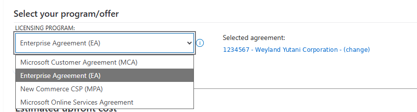

# GitHub @ Constellation Software

> A curated public hub of **GitHub** and **GitHub Copilot** resources for
> Constellation Software Inc. (CSI) portfolio companies — maintained by the
> **GitHub @ CSI team at Microsoft**.

---

## Where are you on the journey?

| 🚚 Migrate | 🤖 Adopt | 📈 Scale |
|---|---|---|
| Move to GitHub from Bitbucket / Azure DevOps / GitLab / SVN → [GitHub Migrations](#-github-migrations) | Level up your team with agentic workflows → [Agentic Workflows](#-agentic-workflows) | Run GitHub & Copilot across your portco at scale → [Governance & Architecture](#-governance--architecture) |

> 💡 **CSI portcos:** use your **large CSI discount** on GitHub
> Enterprise and GitHub Copilot when billed via your portfolio's (or CSI's)
> Azure subscription — **not** a credit card.
> → [How to claim the discount](#-csi-pricing-via-azure-billing)

---

## 📅 CSI Build Days

CSI Build Days is the GitHub & Microsoft @ CSI team's **bi-weekly developer event series**
for engineers across the Constellation Software portfolio. Sessions cover
GitHub fundamentals, migrations, Copilot enablement, agentic workflows,
multi-part workshops, office hours, and Q&A with Microsoft and GitHub
product teams.

> 🎥 **Catch up on past sessions** — full CSI Build Days recording playlist →
> [aka.ms/CSIDevDaysRecordings](https://aka.ms/CSIDevDaysRecordings)

- **Upcoming sessions — register by track:**
  - **Developer Track** — Completed ✔️
  - **Product Track** — [Register on Teams](https://msit.events.teams.microsoft.com/event/msit.b8cadf85-d534-4ab5-858f-0f9c496a7ece@72f988bf-86f1-41af-91ab-2d7cd011db47)
  - **QA Track** — [Register on Teams](https://msit.events.teams.microsoft.com/event/msit.a2d45802-3163-4650-b8bf-11415c76ff8d@72f988bf-86f1-41af-91ab-2d7cd011db47)
  - **DevSecOps Track** — [Register on Teams](https://msit.events.teams.microsoft.com/event/msit.8099c99d-25de-42a3-b378-af01fe473797@72f988bf-86f1-41af-91ab-2d7cd011db47)

---

## 🚚 GitHub Migrations

CSI portcos move to GitHub from Bitbucket Server / Cloud, Azure DevOps Repos,
GitLab, and Subversion.

> 📧 **Planning a migration?** Email
> [DevsAtCSI@microsoft.com](mailto:DevsAtCSI@microsoft.com)
> first. We'll match you with the right tooling, runbook, and (if needed)
> migration partner — instead of you piecing it together from docs alone.

For self-serve reading:

- **GitHub Enterprise migration overview** — [docs.github.com/migrations](https://docs.github.com/en/migrations)
- **Migration paths to GitHub Enterprise Cloud** — [docs.github.com](https://docs.github.com/en/migrations/overview/migration-paths-to-github)

---

## 🤖 Agentic Workflows

For teams maturing beyond interactive Copilot into automated, agent-driven
development:

- **GitHub Agentic Workflows (gh-aw)** — Author agentic workflows as
  natural-language Markdown that run as automation in GitHub Actions. Bring
  your own agent access — you can use your existing **Claude Code**, **Codex**,
  and **Cursor** keys with it. [github.github.com/gh-aw](https://github.github.com/gh-aw/)

---

## 🏷 CSI Pricing via Azure Billing

CSI portfolio companies qualify for a **large CSI discount on GitHub
Enterprise Cloud and GitHub Copilot (Business and Enterprise)** — but **only
when billing flows through an Azure subscription tied to your portco, your
operating group, or CSI**.

> 🏷 **What the discount covers:** a **large discount** on **GitHub** and
> **GitHub Copilot**, including the usage-based **tokens from the default
> models used in GitHub** — Anthropic Claude, OpenAI GPT, Google Gemini, MAI,
> Kimi, and more.

> 📧 **Want the discount amount and how to activate it?** Email
> [DevsAtCSI@microsoft.com](mailto:DevsAtCSI@microsoft.com).
> The GitHub @ CSI team will share the current CSI rate and walk you
> through activation — primarily connecting an **Azure subscription tied
> to a parent CSI entity** (your portco, your operating group, or CSI) to
> your GitHub enterprise account.

> ⚠️ **Credit-card billing on GitHub is NOT eligible for the CSI discount.**
> Personal credit cards and PayPal payment methods on a GitHub enterprise
> account do not qualify. To get the CSI rate, the GitHub enterprise account
> must be connected to an **Azure subscription** owned by your portco, your
> operating group, or CSI.

> ✅ **Two benefits of the Azure-billed path:**
>
> 1. **CSI portco discount** on GitHub Enterprise Cloud and GitHub Copilot
>    (Business / Enterprise) SKUs.
> 2. **Prioritized GitHub support** — Azure-connected CSI enterprises are
>    routed through the GitHub @ CSI team at Microsoft, who can escalate
>    tickets and coordinate directly with GitHub product and support teams.
>    Enterprises billed outside this path do not get this CSI-routed
>    escalation benefit.

#### Eligible SKUs

- **GitHub Enterprise Cloud**
- **GitHub Copilot Business**
- **GitHub Copilot Enterprise**

#### Connect your Azure subscription to GitHub

See [Connecting an Azure subscription (docs.github.com)](https://docs.github.com/en/enterprise-cloud@latest/billing/how-tos/set-up-payment/connect-azure-sub) for the step-by-step procedure.

#### Check whether your discount is active

You can confirm the CSI discount is applied from the
[Azure Pricing Calculator](https://azure.microsoft.com/en-us/pricing/calculator):

1. Sign in with the account tied to your portfolio's Azure billing.
2. Open the **Licensing program** dropdown.
3. If the discount is active, your **licensing agreement with Microsoft — tied
   back to your portfolio** — appears as your selected agreement, similar to the
   example below.

If you **don't** see a Microsoft licensing agreement tied to your portfolio,
the discount isn't active yet. Email
[DevsAtCSI@microsoft.com](mailto:DevsAtCSI@microsoft.com)
and the GitHub @ CSI team will kick off the process to get it set up.

#### Documentation

- **About enterprise billing** — Concepts and supported payment methods. [docs.github.com](https://docs.github.com/en/enterprise-cloud@latest/enterprise-onboarding/getting-started-with-your-enterprise/about-enterprise-billing)
- **Azure subscription payments (concept)** — How GitHub enterprise usage shows up on your Azure invoice. [docs.github.com](https://docs.github.com/en/enterprise-cloud@latest/billing/concepts/azure-subscriptions)
- **Billing through Azure subscriptions (reference)** — Detailed reference for what's billable through Azure and how. [docs.github.com](https://docs.github.com/en/enterprise-cloud@latest/billing/reference/azure-billing)

#### Cost management & chargeback

For portcos that allocate GitHub costs back to teams or products on Azure:

- **Azure Cost Management overview** — Cost analysis, budgets, alerts, and exports. [learn.microsoft.com](https://learn.microsoft.com/en-us/azure/cost-management-billing/costs/overview-cost-management)
- **Tag your Azure resources** — Use tags on the Azure subscription / resource group to attribute GitHub line items to the right team, product, or cost center. [learn.microsoft.com](https://learn.microsoft.com/en-us/azure/azure-resource-manager/management/tag-resources)

#### Need help?

If you hit issues during the connect-to-Azure flow (admin consent,
ownership mismatches, eligibility questions), email
[DevsAtCSI@microsoft.com](mailto:DevsAtCSI@microsoft.com)
and the GitHub @ CSI team will help unblock you.

---

## 💳 Usage-Based Billing (UBB)

Resources to help CSI portcos prepare for Copilot's move to usage-based
billing on June 1.

- **🌐 GitHub @ CSI team recommendations** — Practical playbook for CSI portcos: what's changing June 1, a 5-step rollout plan, what not to overreact to, how UBB interacts with the CSI Azure-billing discount, and curated UBB resources including interactive tools and checklists. [usage-based-billing/](./usage-based-billing/)
- **Copilot Cost Compass (interactive tool)** — Animated UBB explainer, budget-flow scenarios, decision tree, budget calculator, and a model-selection playbook for token optimization. [aka.ms/ubb-tool](https://aka.ms/ubb-tool)
- **Announcement (blog)** — GitHub Copilot is moving to usage-based billing. [github.blog](https://github.blog/news-insights/company-news/github-copilot-is-moving-to-usage-based-billing/)
- **UBB documentation** — Concept docs for usage-based billing in organizations and enterprises. [docs.github.com](https://docs.github.com/en/copilot/concepts/billing/usage-based-billing-for-organizations-and-enterprises)
- **UBB pricing & models** — Reference for Copilot billing models and pricing. [docs.github.com](https://docs.github.com/en/copilot/reference/copilot-billing/models-and-pricing)
- **GitHub Community FAQ** — Discussion thread with frequently asked questions. [github.com/orgs/community/discussions/192948](https://github.com/orgs/community/discussions/192948)
- **Copilot code review changelog** — Code review will start consuming GitHub Actions minutes on June 1, 2026. [github.blog/changelog](https://github.blog/changelog/2026-04-27-github-copilot-code-review-will-start-consuming-github-actions-minutes-on-june-1-2026/)

---

## 🏛 Governance & Architecture

For portcos running GitHub at scale across many orgs and operating groups:

- **GitHub Well-Architected Framework** — Reference architecture for GitHub & Copilot. [wellarchitected.github.com](https://wellarchitected.github.com/)
- **Multiple orgs under one enterprise** — Patterns for portco-per-org topologies. [docs.github.com](https://docs.github.com/en/enterprise-cloud@latest/admin/managing-your-enterprise-account/about-enterprise-accounts)
- **Enterprise Managed Users (EMU)** — Identity-managed access & provisioning. [docs.github.com](https://docs.github.com/en/enterprise-cloud@latest/admin/managing-iam/understanding-iam-for-enterprises/about-enterprise-managed-users)

---

## 💬 Get in Touch

- **Email us** — [DevsAtCSI@microsoft.com](mailto:DevsAtCSI@microsoft.com)
- **Open an issue** to suggest a resource, report a broken link, or request a topic — see [issue templates](.github/ISSUE_TEMPLATE) and [CONTRIBUTING.md](CONTRIBUTING.md).
- **Through your Microsoft account team** — they can route you to the GitHub @ CSI team directly.

---

## 🛠 Contributing

Suggestions, broken-link reports, and improvements welcome — see [CONTRIBUTING.md](CONTRIBUTING.md). By participating, you agree to the [Microsoft Open Source Code of Conduct](CODE_OF_CONDUCT.md).
